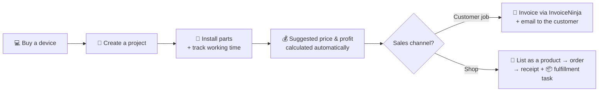

# 📋 secondtrack — what it does & how

> Your **cockpit** for a refurbishing side business: buy devices, fix them up,
> sell them — and always keep working time, costs and profit in view. Invoicing,
> tasks and the shop all come together here, pulled from connected systems.

---

## 🧭 In one sentence

secondtrack is the **one overview** where everything comes together — it works out
your profit and orchestrates shop, invoices and tasks, **without you having to
type anything twice**.

---

## 🗂️ The areas (the left-hand menu)

| Icon | Area | What you do there |
|:--:|------|-------------------|
| 🏠 | **Dashboard** | Home screen with freely arrangeable tiles (revenue, projects, warehouse, orders …). Drag & resize. |
| 📊 | **Statistics** | All the numbers at a glance: working hours, material costs, warehouse value, expected revenue & profit. |
| 🧾 | **Expenses** | Record business expenses with a receipt photo (project / warehouse / advertising). Mirrored to InvoiceNinja. |
| 📦 | **Warehouse** | Virtual parts warehouse. Harvested parts land here automatically; purchases you add yourself. |
| 🖥️ | **Projects** | The core: each device as a project with parts, working time, customer, notes & price calculation. |
| ✅ | **Tasks** | Your to-dos & Kanban boards (from Vikunja). Shop fulfillment tasks also land here. |
| 💰 | **Finances** | The Hub: shop orders + all invoices + KPIs from InvoiceNinja in one place. |
| ⚙️ | **Settings** | Connections, appearance, email, account & 2FA, dashboard. |

---

## 🔄 The typical flow

1. **Buy a device** → create it as a **project** (enter the purchase price).
2. **Fix it up** → record the installed **parts** and **work sessions** (date, hours).
3. **See the price** → secondtrack suggests a price automatically and shows the profit.
4. **Sell** → either an **invoice** straight to the customer, or list it in the **shop**.

> 🛒 How a shop order automatically becomes a receipt + fulfillment task is described in
> **[SHOP-ORDERS.md](SHOP-ORDERS.md)**.

---

## 💰 How price & profit are calculated

secondtrack computes this automatically for every project:

| Value | Meaning |
|-------|---------|
| **Material cost** | device purchase price **+** purchase cost of the installed parts |
| **Labor value** | tracked hours **×** hourly rate (global or per project) |
| **Suggested price** | device cost **+** parts value **+** labor value |
| **Gross profit** | sale price **−** material cost |
| **Net profit** | sale price **−** material cost **−** labor value |

> 💡 You can set your own **list price** — otherwise secondtrack uses the suggested
> price. The **hourly rate** is configurable globally, per project, or even per
> individual work session.

---

## 🔌 Connections (the systems it links to)

secondtrack does a lot itself, but delegates specialist jobs to proven tools —
each one is **optional** and can be toggled on/off individually.

| System | For | Without it… |
|--------|-----|-------------|
| 🛒 **WooCommerce** | your online shop — orders arrive here | …the shop part won't work |
| 🧾 **InvoiceNinja** | the actual **invoicing engine** (numbers, PDF, VAT, payments) | …there are no invoices/receipts |
| ✅ **Vikunja** | your **tasks & Kanban boards** | …no tasks / fulfillment tasks |
| ☁️ **Nextcloud** | files invoice **PDFs** away, neatly (year/month) | …no automatic filing |
| 🏷️ **eBay** | **price suggestions** for the warehouse (what is a part worth?) | …no market-price hints |

> 🧩 **Core principle:** every piece of information has **exactly one home**. Invoices
> live in InvoiceNinja, tasks in Vikunja, orders in the shop — secondtrack reads
> everywhere and brings it together, but never keeps a second, conflicting copy.

---

## ✨ Extras that just run along

- 🔐 **Login with optional 2FA** (TOTP app) — password changeable in the settings.
- 📝 **Obsidian export** — every project as a tidy `.md` file (download or straight into the vault).
- 📧 **Email automation** — receipts, payment reminders and dunning notices go out
  automatically (via your own SMTP server or via InvoiceNinja).
- 🎨 **Customize the look** — accent colors, font, wallpaper, tile transparency, menu width.
- 🌍 **Bilingual** — German & English.
- 🤖 **Background jobs** — automatically check for new orders, send due dunning notices,
  and file paid invoices to Nextcloud. Runs without you doing anything.
- ⌨️ **Keyboard shortcuts** — show them with `Ctrl + /`.

---

## ⚙️ Where do I set what?

Everything under **Settings**:

| Tab | Set here |
|-----|----------|
| **Connections** | the 5 systems above (URLs, access keys, on/off) + shop automation |
| **Appearance** | colors, font, wallpaper, menu |
| **Email & sending** | own SMTP or InvoiceNinja, templates, reminder/dunning intervals |
| **Account** | password, 2FA, hourly rate, currency |
| **Dashboard** | which tiles, in which size |

---

## 🆘 When something's missing

| Observation | Usually caused by… |
|-------------|--------------------|
| Area shows “disabled” | the matching **connection** is off in the settings |
| No invoices/receipts | check **InvoiceNinja** |
| No tasks | check **Vikunja** |
| No orders | check **WooCommerce** (see [SHOP-ORDERS.md](SHOP-ORDERS.md)) |
| Price/profit looks wrong | check purchase price, part values and hourly rate |

> If a connection is off or unreachable, secondtrack says so politely — it **never
> crashes**, the rest keeps working.

---

*This guide describes the current state for day-to-day use. Technical details are in
`README.md`.*
