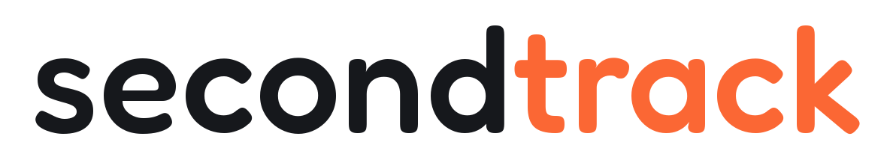

<div align="center">

<picture>
  <source media="(prefers-color-scheme: dark)"  srcset="assets/icons/secondtrack_banner-white.png">
  <source media="(prefers-color-scheme: light)" srcset="assets/icons/secondtrack_banner-black.png">
  
</picture>

<br>
<br>
<br>

**secondtrack** is a self-hosted cockpit for a refurbishing and repair business.

</div>

Buy hardware, register it in a warehouse that knows what every piece cost, build it into a project,
log the hours, and read the profit at the end. Invoices live in InvoiceNinja, tasks in Vikunja,
orders in WooCommerce, files in Nextcloud.

secondtrack reads all of them and brings them together, and never keeps a second copy of something
that already has a home somewhere else.

<br>
<br>

## Install

```sh
git clone https://github.com/vredix-openvuture/secondtrack.git && cd secondtrack
cp .env.example .env && docker compose up -d --build
```

Before the second command, open `.env` and set `SECONDTRACK_SECRET_KEY` to a long random string
(`python -c "import secrets; print(secrets.token_hex(32))"`) plus `SECONDTRACK_ADMIN_USER` and
`SECONDTRACK_ADMIN_PASSWORD`. Those two create the single account on first start and are ignored
afterwards, so the password is changed in the settings, not in the file.

The app then answers on port `40019`, creates its SQLite database on first request, and runs every
schema migration it needs at startup. Everything else, all five connections included, is configured
in the web interface. Nothing has to be enabled for the app to work: with no connection at all you
still get the warehouse, projects, expenses and the numbers.

As shipped, `compose.yaml` expects two things from the host: an external Docker network named
`nginxpm_web` (`docker network create nginxpm_web` if you do not already run one) and a writable
`/server/secondtrack/data`. Both are single lines to change. Behind HTTPS, also set
`SECONDTRACK_COOKIE_SECURE=1`, and set the public base URL under Settings, because that is what the
QR codes on your labels point at.

Requirements: Docker with the compose plugin. For a checkout instead, Python 3.12,
`pip install -r requirements.txt`, then `uvicorn app.main:app --reload`; label printing additionally
wants a `cups-client` on the machine, which the container already carries.

Uninstall with `docker compose down`. The database, the uploads and the exports are all in the one
data directory, so deleting that removes everything secondtrack ever wrote.

<br>
<br>

## Features

### The warehouse, in four departments

<table><tr><td width="33%"></td><td width="33%"></td><td width="33%"></td></tr></table>

Most tools track stock in one list and cost in another. Here it is one row: an item is bought once,
sits on a shelf, moves into a build, and carries its purchase price the whole way, which is what
makes the profit at the end an actual number rather than an estimate.

| Department | What it holds |
|---|---|
| **Parts** | Loose stock, plus the members of a purchase lot. The things you build with. |
| **Merch** | Stickers, shirts, cases. Stock you hand over or sell alongside a build, not something you build with. |
| **Purchase lots** | One receipt, one total, several products. The total is split across the members by sale value. |
| **Finished goods** | Assemblies. A WIP build while parts are still going in, a finished good once it is done. |

- **A receipt is mandatory.** Every purchase wants a PDF or a photo, unless you mark it as free or
  point it at an expense that is already booked. There is no way to quietly create stock that cost
  nothing.
- **Booking takes units, not rows.** Three of ten fans go onto the project, seven stay on the shelf,
  and the row splits itself. The receipt stays in the warehouse in that case, because one receipt
  for ten must not land whole on the project that took three.
- **A free handout is advertising.** Hand merch over at no charge and the project bills it at zero
  and carries none of its material cost, while the money you spent on it shows up as advertising
  cost on that project and in the statistics.
- **The set is one line.** A lot or a finished good is billed once at its own price, and its members
  never appear next to it, so the same purchase is not charged twice.
- **Sending it back works too.** Remove an item from a project and it returns to the shelf as a
  harvested part, keeping its resale value and losing its handout flag.
- **Categories with their own fields**: a category defines text, number, select, boolean and date
  fields, so a CPU can carry a platform and a drive can carry a capacity. Seven optional fields
  (serial number, MPN, EAN, unit, reorder level, purchase date, warranty date) are global and apply
  to every product.
- **Suppliers** with contact, address, website, your account number and notes.
- **Low stock** is a reorder level per product and a filter that lists everything at or below it.
- **Grouping and filtering** by category, supplier or location, each group with its own subtotal.
- **eBay price suggestion**: the median asking price of up to 50 current used and refurbished
  fixed-price listings, next to the price field.
- **Stock value at the top**: what the shelf cost, what it is worth, what the merch is worth, and
  how much has been given away.

### Scan codes, labels and locations

<table><tr><td width="33%"></td><td width="33%"></td><td width="33%"></td></tr></table>

- **Every part, set and location gets a code** on creation, in the shape `CPU-3K7Q`: three
  characters for what it is (the category name, else `PRT`, `SET`, `WIP`, `PRD`, `MER`, `LOC`) and
  four from an alphabet with no `0`, `O`, `1`, `I` or `L`, so nothing is ever read back wrong.
- **`/s/<code>` opens the object**, which is what the QR encodes. A part on a project sends you to
  the project, a merch item to the merch department, a location to the location tree.
- **Labels are 2 by 1 inch at 203 dpi**, the native resolution of the usual thermal label printers,
  so the image maps to printer dots without rescaling. QR with the name beside it, or Code128
  across the full width.
- **Four ways to get the label out**: view it in the browser, download PNG, PDF or SVG. The PDF
  carries a binding page size, which the PNG cannot, and the SVG opens in a drawing program.
- **Printing happens on the server** through CUPS with the media size set explicitly, so it works
  the same from a tablet as from a desktop and never depends on a browser print dialog.
- **Storage locations are a tree**: room, rack, shelf, bin. Filtering by the rack includes its
  shelves. Deleting one moves its children and its contents up a level instead of losing them.
- **Scanning in the app** uses the camera through the browser's barcode detector, which needs
  HTTPS, and the same field accepts a handheld USB or Bluetooth scanner.

### Projects, time and price

<table><tr><td width="33%"></td><td width="33%"></td><td width="33%"></td></tr></table>

A project is a container with a number of the form `PJ-20260815-K4QW`, a customer, a type and a
status (open, in progress, done, invoiced). It creates nothing itself: items are made in the
warehouse and picked from it.

- **Work sessions** with date, hours and description. The rate comes from the global setting, or
  from the project, or from the individual session, in that order.
- **The calculation**, on the page and in the invoice from the same list of items: material cost,
  advertising cost, labour value, a suggested price, and your own list price if you set one, then
  gross and net profit.
- **Project types** are rows you can extend. Each one declares whether its builds may become shop
  stock, which is the one thing that decides whether a finished project can be shelved as a
  sellable good or has to be invoiced.
- **Customers** are internal or backed by an InvoiceNinja client, picked from the live client list
  or created on the spot.
- **Reference photos** in a gallery with captions, for the condition at handover or the cable
  routing before disassembly.
- **Markdown reports** on the project, with a slash menu for checklists, bullets, numbered lists
  and headings.
- **Expenses** can be booked onto the project after the fact, and every expense that arrived with
  one of its items is listed there.
- **Markdown export** with YAML front matter, as a download or written straight into a mounted
  Obsidian vault.
- **Invoicing** creates the InvoiceNinja invoice from the project's items and hours, and travels
  under the project number as the PO number, so the customer never sees an internal id.
- **Check the invoice before it goes out.** The document opens inside secondtrack, and from that
  one place you can send it, download it, regenerate it from the project as it stands now, or
  delete it. Sending shows the recipient first, read live from InvoiceNinja: the address, the
  contact, the amount, the due date, and which mail route it takes.

### Expenses, invoices and the finance hub

<table><tr><td width="33%"></td><td width="33%"></td><td width="33%"></td></tr></table>

- **Every expense carries its receipt**, PDF or image, and is allocated to a project, to the
  warehouse or to advertising.
- **Mirrored into InvoiceNinja** as an expense with the receipt attached as a document, including
  the vendor and the category, which are created there if they do not exist yet.
- **A resync button** re-aligns InvoiceNinja with the local list, for when expenses were wiped or
  edited on that side and the normal push considers them already sent.
- **The hub** shows what InvoiceNinja knows: paid, outstanding and drafts, for all time, this year
  or this month, and every invoice with its status, balance, due date, an overdue mark and a deep
  link. Drafts are hidden by default.
- **Reminders and dunning** go out at a configurable number of days past the due date, 0 and 30 by
  default, each one sent at most once per invoice.
- **Mail goes out one of two ways**: through your own SMTP with your own templates and the PDF
  attached, or by asking InvoiceNinja to send it through its own. Four templates, with
  placeholders for client, number, amount, due date, link and company.
- **Nextcloud archives the paid invoices** under `Invoices/<year>/<month>/<number>_<customer>.pdf`,
  re-uploads one that changed, moves a deleted one into a `deleted/` subfolder, and marks the row
  in the hub once the file is up. Receipts go to `Expenses/<year>/<month>/` when they are created.
- **Three background loops** run without you: due mail daily, the Nextcloud sync every 15 minutes,
  and the order check on its own interval. Each one has a button next to it for doing it now.
- **Statistics**: hours and their value, material expenses, warehouse stock cost, advertising cost,
  expected sale value and the profit before and after labour, plus income against expenses for the
  month, the year or all of it.

### Shop orders and tasks

<table><tr><td width="33%"></td><td width="33%"></td><td width="33%"></td></tr></table>

A paid WooCommerce order arrives, and four things happen without anyone typing: a paid document is
created in InvoiceNinja and emailed as a receipt, the buyer is stored as a customer and linked to
the InvoiceNinja client, and a task appears in Vikunja with the packing list, the shipping address,
the contact, the total and the customer's note.

- **Two ways in**: a webhook, verified by HMAC-SHA256 against the WooCommerce secret, or polling on
  an interval, 5 minutes by default. Polling sets a watermark when you switch it on, so it never
  works through your order history.
- **Never twice.** One order produces one invoice, one customer and one task, no matter how often
  it is seen.
- **Tasks come from Vikunja**, the subprojects of a parent project you name. Open tasks across all
  of them, or one board at a time, as a list or as Kanban with drag and drop between the columns.
- **Editable from here**: title, description, priority, due date, done state, and labels, which are
  matched by name or created if they are new. A task can be linked to a secondtrack project.
- **The board background** is proxied through the server, so your Vikunja token never reaches the
  browser.

### The interface

<table><tr><td width="33%"></td><td width="33%"></td><td width="33%"></td></tr></table>

- **A dashboard you arrange yourself** from ten tiles: greeting, finances, active projects,
  warehouse, open invoices, shop orders, tasks, quick access, scan and your own logo. Drag them on
  a grid, resize them, or reset the layout.
- **Style**: two accent colours, a background colour, corner radius from 0 to 28, five fonts, a
  comfortable or compact density, a glass effect, card opacity from 40 to 100, and whether the
  sidebar starts open.
- **A wallpaper** with blur up to 40 pixels and dimming up to 95 percent.
- **Installable**, with a service worker that caches the static shell and deliberately nothing
  else, because the pages are full of customer data and a tablet gets picked up by other people.
- **Keyboard shortcuts**: `Ctrl` `/` for the list, `g` then `d`, `p`, `w`, `h`, `t` or `s` to
  navigate, `n` to create, `Esc` to close.
- **English and German**, switched in the settings.
- **Login with optional two-factor**, enrolled by scanning a QR code, with the password changeable
  in the settings.
- **Uploads are compressed** to WebP at a longest edge of 1600 pixels, or 2400 for a receipt, from
  files of up to 25 MB, so a phone photo does not fill the volume and every backup with it.

<br>

## Roadmap

Roughly ordered by how much of it already exists.

- **Listing a project in the shop.** The WooCommerce product upsert is written and produces a draft
  product from a finished project, but nothing in the interface calls it yet, so the shop listing
  is still made by hand.
- **Linking an order back to the build that filled it.** The reconcile step still matches the
  legacy project kind, which no project created today carries, so it only ever fires for projects
  from before the rework.
- **Retiring the device model.** Devices were replaced by plain warehouse items and the migration
  runs on every start, but the table and the legacy project statuses are still in the code for the
  databases that have not been through it.
- **One language per message.** The interface is translated, roughly 600 strings, but a handful of
  status messages from the warehouse and project routes are still hard-coded German.
- **More than one user.** The account model holds a single user and the settings are global.
- **Statistics worth a page of their own.** The numbers are all computed; what is missing is a
  history, so you can see a month against the one before it.
- **Tests.** There are none.

<br>

## Links

[Documentation](https://github.com/vredix-openvuture/secondtrack-wiki) ·
[Screenshot list](docs/img/SHOTLIST.md) ·
[Velumeron](https://github.com/vredix-openvuture/velumeron)

MIT licensed.

---

<br>
<br>

<a href="https://ko-fi.com/openvuture"></a>

<a href="https://openvuture.com"></a> <a href="https://openvuture.shop"></a>
