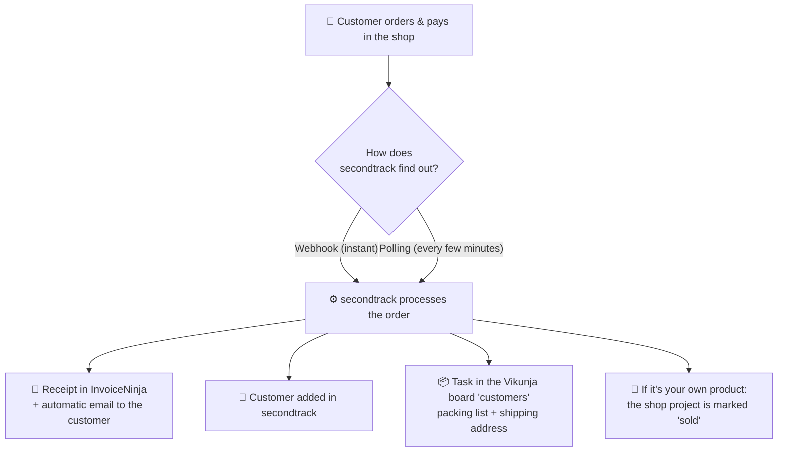

# 🛒 Shop orders in secondtrack

> What happens when an order comes in from the WooCommerce shop — explained simply.

---

## In one sentence

**An order comes in → secondtrack automatically creates the receipt, adds the
customer, and creates a task telling you “what to pack & ship”.** You don't type
anything.

---

## The flow at a glance

---

## Step by step: what happens automatically

As soon as a paid order arrives, secondtrack does all of this **in one go**:

| # | Step | Result |
|---|------|--------|
| 1 | **Receipt** | A paid document is created in InvoiceNinja and the customer automatically gets their receipt by email. |
| 2 | **Customer** | The buyer is stored as a customer in secondtrack (name, email, company) and linked to the InvoiceNinja client. |
| 3 | **Task** 📦 | A task is created in the Vikunja board **“customers”** with everything you need to ship it. |
| 4 | **Own goods** | If the ordered product was a shop project you built, it is automatically marked as **sold**. |

> 💡 **The most important part for you is step 3** — the task tells you in black and
> white what goes in the box and where it's headed.

---

## What the fulfillment task contains

The task in Vikunja is named e.g. **“📦 Order #812 – Max Mustermann”** and contains:

- ✅ **Packing list** — which items, how many, with SKU
- 📮 **Shipping address** — name, street, ZIP/city, country
- ✉️ **Contact** — the customer's email & phone
- 💶 **Total** of the order
- 📝 **Customer note** (if present, e.g. “please gift-wrap”)
- 🔗 **Links** straight to the order in the shop and to the invoice

Once you've packed and shipped the goods → **check off** the task in Vikunja. Done.

---

## Where do I see what?

| I want to see… | …then I look here |
|----------------|-------------------|
| All orders + status | **Hub** in secondtrack (the 📦 column links straight to the task) |
| What I need to ship | **Vikunja → “customers” board** |
| The invoice / receipt | **InvoiceNinja** (or via the link from the Hub) |
| The customer | appears in secondtrack (e.g. in the customer picker on projects) |

---

## Two ways the order arrives

You only need **one** of them — the webhook is recommended.

| | 🔔 Webhook | 🔁 Polling |
|--|-----------|-----------|
| **How** | The shop reports every order to secondtrack **instantly** | secondtrack **asks** for new orders itself every few minutes |
| **Speed** | seconds | depends on the interval (default 5 min) |
| **Setup** | add a webhook once in the WooCommerce admin | just one checkbox in secondtrack |
| **Good when…** | you want it instantly | you can't/won't change anything in the shop |

---

## What must be set up once

Everything under **Settings → Connections** in secondtrack:

| Connection | For | Needed for |
|------------|-----|------------|
| **WooCommerce** | shop URL + API key/secret, order statuses, webhook/polling | receiving orders at all |
| **InvoiceNinja** | URL + API token | receipt & invoice |
| **Vikunja** | URL + token | the fulfillment task 📦 |

Plus, in the **WooCommerce** tab, the new block **“Fulfillment task on order”**:

- ☑️ **Create fulfillment task** — on/off (default: on)
- 🗂️ **Vikunja board** — which board the task goes into (default: `customers`, created automatically if missing)

> ⚠️ Without an active **Vikunja** connection no task is created (everything else still runs).

---

## Good to know 🛟

- **No duplicates:** if something runs twice (e.g. webhook + polling at the same time),
  you still get **only one** task, **one** customer and **one** invoice per order.
- **Nothing breaks:** if Vikunja is ever unreachable, the receipt is still created —
  the task simply follows on the next attempt.
- **New orders only:** orders that come in after enabling get a task. Older orders
  from before are **not** back-filled.

---

## When something is missing 🔧

| Problem | Likely cause |
|---------|--------------|
| No task in Vikunja | Vikunja connection off, or “fulfillment task” disabled |
| No order in the Hub | WooCommerce connection/status wrong, or webhook/polling off |
| No receipt / no email | check the InvoiceNinja connection |
| Task in the wrong board | adjust the board name in the WooCommerce tab |

---

*This file describes the current state of the shop-order flow. Implementation details
are in the code under `app/services/hub.py`.*
